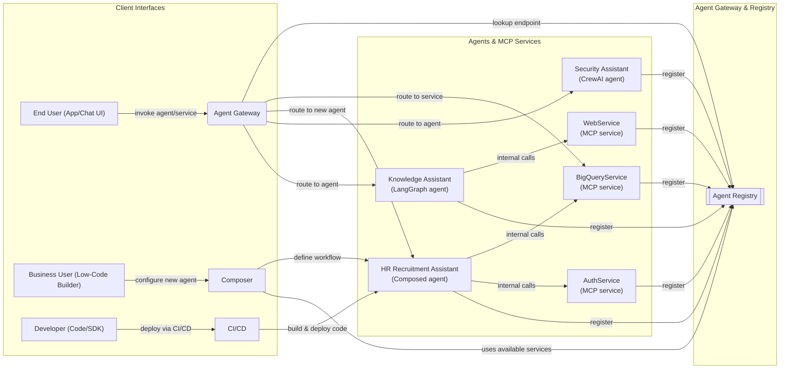
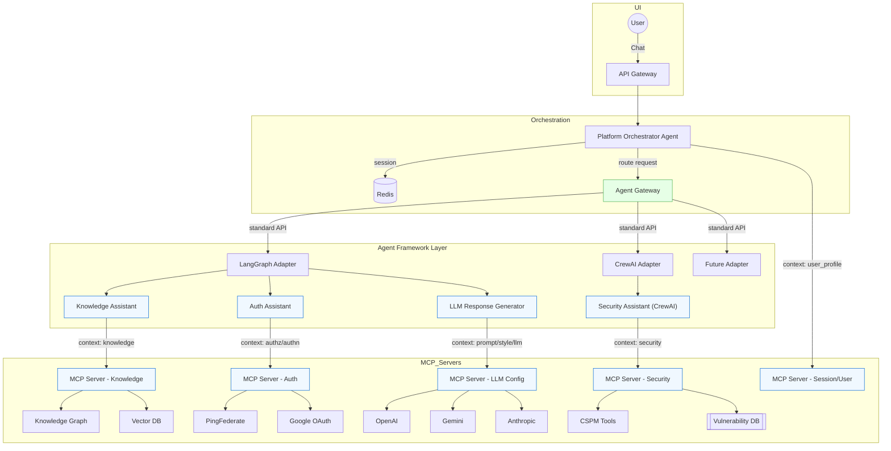

### MCP server inclusion

Modern AI **agents** often combine multiple tools and data services to accomplish complex tasks. In our scenario, we have both prebuilt AI assistants (e.g. a Knowledge Assistant built on LangGraph, a Security Assistant on CrewAI) and standalone microservices providing specific capabilities (e.g. a BigQuery query service, a web browsing service, an authentication service). The goal is to treat all these components as *first-class agents* in a unified architecture. This means exposing them through a single **Agent Registry** (for discovery) and an **Agent Gateway** (for invocation) with a common interface and metadata. By standardizing how agents and services are registered and invoked, we eliminate custom one-off integrations and achieve a modular, scalable system [dev.to](https://dev.to/sudhakar_punniyakotti/mcp-the-api-gateway-for-ai-agents-4ldn#:~:text=Inspired%20by%20microservices%20architecture%2C%20MCP,integrate%20seamlessly%20into%20broader%20workflows)[huggingface.co](https://huggingface.co/blog/Kseniase/mcp#:~:text=It%E2%80%99s%20important%20to%20highlight%20again,are%20called%20and%20information%20exchanged) . In this architecture, an AI agent can seamlessly discover and call any tool or service via a common protocol, much like plugging into a universal API **gateway**[huggingface.co](https://huggingface.co/blog/Kseniase/mcp#:~:text=It%20is%20akin%20to%20a,sophisticated%20tasks%20across%20diverse%20contexts) The unified approach has several benefits:

* **Dynamic discovery:** New services or agents can be introduced and immediately discovered by others without hardcoding (thanks to a central registry) [huggingface.co](https://huggingface.co/blog/Kseniase/mcp#:~:text=One%20striking%20feature%20is%20MCP%E2%80%99s,a%20standardized%20API%2C%20offering%20flexibility).
* **Modularity:** Each capability (whether a full agent or a single service) is a self-contained microservice that can be developed, deployed, and scaled independently [dev.to](https://dev.to/sudhakar_punniyakotti/mcp-the-api-gateway-for-ai-agents-4ldn#:~:text=Inspired%20by%20microservices%20architecture%2C%20MCP,integrate%20seamlessly%20into%20broader%20workflows).
* **Unified access:** Clients (end-users or applications) have a single entry point (Agent Gateway) to interact with any agent or service, simplifying integration.
* **Flexible composition:** Developers or even business users can compose new agents by wiring together existing services or agents via code or a visual builder, leveraging the common interface.

Below we present an updated architecture diagram and a detailed explanation of each layer, the flows for agent creation and usage, environment management, and key design considerations.




### Why Is MCP Better Than Just a Service?

| Feature                  | Normal API               | MCP Server                                         |
| ------------------------ | ------------------------ | -------------------------------------------------- |
| Discovery                | Manual (docs, hardcoded) | ✅ Self-describing via `/tools`                  |
| Integration by Agents    | Manual coding per tool   | ✅ Auto-wired by LangGraph, CrewAI                 |
| Standard Tool Schema     | ❌ Inconsistent          | ✅ JSON input/output with examples                 |
| Registry compatibility   | ❌ No formal model       | ✅ Can be registered & discovered                  |
| Dynamic Composition      | ❌ Not easily composable | ✅ Agents build workflows dynamically              |
| LLM Readiness (tool use) | ❌ Prompt hack needed    | ✅ Plug-and-play with tool calling                 |
| Reusability              | Manual API doc           | ✅ Self-documenting + reuse by agents              |
| Framework Agnostic       | Usually tied to impl     | ✅ Can be used from any framework via standard API |


**What Makes a Service an MCP Server?**

A **normal API service** (e.g., `/run_query`, `/get_user`) exposes endpoints, but:

* It **lacks structured discovery** — other agents/tools don’t know what it can do unless hardcoded.
* There’s **no shared contract** or handshake between agents and services.
* It can’t be composed automatically — unless you write a wrapper or adapter every time.

An  **MCP server** , on the other hand:

* Exposes **a machine-readable schema** (`GET /tools`) that lists all the actions (functions/tools) it can perform.
* Each tool/action includes: name, description (for the LLM), input/output schemas, examples — so an LLM agent (or orchestration platform) can **auto-discover, auto-plan, and invoke** the tools.
* Follows a **standard interface contract** (like OpenAPI for LLM tool use) — consistent across all services.
* Enables **dynamic registration and chaining** — agents can load its capabilities and use them like plugins.


### FastAPI Example: BigQuery MCP Server

Let’s write a **simplified FastAPI-based MCP server** called `BigQueryMCPServer`.


```python
# bigquery_mcp_server.py
from fastapi import FastAPI, Request
from pydantic import BaseModel
from typing import List, Dict

app = FastAPI(title="BigQuery MCP Server")

# 1. This defines the tool interface
class RunQueryInput(BaseModel):
    query: str

class RunQueryOutput(BaseModel):
    rows: List[Dict]

# 2. The main tool execution endpoint
@app.post("/run_query", response_model=RunQueryOutput)
async def run_query(input: RunQueryInput):
    # Simulate BigQuery response (replace with real query logic)
    print(f"Running: {input.query}")
    return RunQueryOutput(rows=[{"region": "X", "sales": 5200000}])

# 3. MCP discovery endpoint (this is what makes it an MCP server)
@app.get("/tools")
async def list_tools():
    return {
        "tools": [
            {
                "name": "run_query",
                "description": "Run a SQL query on BigQuery and return rows.",
                "input_schema": RunQueryInput.schema(),
                "output_schema": RunQueryOutput.schema(),
                "examples": [
                    {
                        "input": {"query": "SELECT * FROM sales"},
                        "output": {"rows": [{"region": "X", "sales": 5200000}]}
                    }
                ]
            }
        ]
    }

```


How Do Agents Use It?

Let’s say you have a **LangGraph agent** that connects to the registry, reads the `/tools` from `BigQueryService`, and gets:

```json
{
  "name": "run_query",
  "description": "Run a SQL query on BigQuery and return rows.",
  "input_schema": { "query": "string" },
  "output_schema": { "rows": [{ "region": "X", "sales": 5200000 }] }
}

```

It registers that as a  **tool in the agent runtime** , and the LLM can now invoke:

```json
{
  "tool": "run_query",
  "args": { "query": "SELECT * FROM sales WHERE region = 'X'" }
}

```

That’s how  **MCP bridges AI agents and backend services** . It  **removes glue code** , makes your services  **composable** , and aligns with **tool-use-by-LLM** standards — especially helpful in agentic platforms like LangGraph, Autogen, CrewAI.




### Comparision of Agent Framework

Below is a tabulated comparison for clarity, focusing on the top five features:

#### Tabular comp

| Feature                      | LangGraph                             | CrewAI                | AutoGen                              | MCP                                   |
| ---------------------------- | ------------------------------------- | --------------------- | ------------------------------------ | ------------------------------------- |
| Architecture Type            | Hierarchical, Centralized             | Collaborative, Linear | Conversational, Group-Chat           | Integration Protocol                  |
| Workflow Complexity Handling | Excellent                             | Moderate              | Good                                 | Low                                   |
| State Management             | Native(explicit state management)     | Limited               | Basic                                | High (External Data)                  |
| Ease of Integration          | High(LangChain ecosystem)             | Moderate              | Moderate to High                     | Excellent(standardizes integrations)  |
| Scalability                  | Excellent                             | Good                  | Moderate                             | Moderate                              |
| GKE/Kubernetes-friendly      | High                                  | Moderate              | Moderate (more conversational)       | Moderate (integration servers needed) |
| Production Readiness         | Production-grade (used in enterprise) | Early adoption stage  | Production usable but conversational | New (experimental phase)              |

#### Conclusion

This analysis reveals that LangGraph is the top choice for complex, stateful, and scalable multi-agent systems, particularly in enterprise settings. CrewAI suits simpler, collaborative tasks, while AutoGen is ideal for dynamic, conversational applications. MCP, unexpectedly, excels in integration and state management for external data, but its lower workflow handling suggests it’s complementary rather than a direct competitor for agent orchestration. Developers should choose based on specific needs, such as workflow complexity, integration requirements, and scalability goals.


### **Comparison of Agentic Architectures**

The comparison table between **Hierarchical Multi-Agent** and other architectures:

| Architecture Type                     | Hierarchical Multi-Agent             | Single-Agent                      | Flat Multi-Agent                     |
| ------------------------------------- | ------------------------------------ | --------------------------------- | ------------------------------------ |
| **Complex Task Handling**       | Excellent (specialized roles)        | Limited                           | Good (parallel agents)               |
| **Scalability & Extensibility** | Excellent (add new agents easily)    | Poor (monolithic design)          | Good                                 |
| **Debugging & Maintenance**     | Easier (clear responsibility)        | Simple (single entity)            | Moderate (more complex interactions) |
| **Resource Efficiency**         | Good (modular scaling)               | High (single instance)            | Moderate (resource overlap)          |
| **Context & State Management**  | Excellent (clear hierarchical state) | Simple (single context)           | Complex (flat state management)      |
| **Cross-agent Collaboration**   | Explicit & Controlled                | None (single agent only)          | Good (peer collaboration)            |
| **Failure Isolation**           | Excellent (failure contained)        | Poor (single point of failure)    | Moderate                             |
| **Recommended Use Case**        | Enterprise complex workflows         | Simple chatbots, basic assistants | Agent swarms, parallel simple tasks  |

**Conclusion:**

**Hierarchical Multi-Agent** is ideal for your enterprise platform as it provides clear modularity, scalability, easier debugging, and explicit control of context across specialized agents.

The proposed design is very much in line with emerging industry practices. For instance, LinkedIn’s AI recruiter system uses a hierarchical agent system with LangGraph – breaking down conversational search and matching into multiple layers of agents [langchain.com](https://www.langchain.com/built-with-langgraph#:~:text=AI%20that%20hires%20top%20talent) . Similarly, other companies have found that a network of specialized agents can outperform a single monolithic agent for complex workflows.


### Platform Orchestrator (Router)

The **Platform Orchestrator** is the entry point for all user interactions. Deployed as a microservice (container) on GKE, it receives incoming user requests (e.g., chat messages or queries) and coordinates the flow across the other components. Key responsibilities of the Orchestrator include:

* **Session Management:** It maintains conversation context by storing and retrieving session data in a Redis store. Upon receiving a request, the Orchestrator fetches the session state (if any) from Redis (or Firestore) using a session ID or user token. This context might include the history of the conversation and any relevant variables. After processing the request, it updates the state back to Redis for future turns. Using Redis ensures low-latency access to session data in memory, which is ideal for quick lookups per request. (Firestore could serve as a persistent store for session data if long-term storage is needed, but Redis is used for fast ephemeral session caching.)
* **Routing Logic:** Based on the user input and possibly the session context, the Orchestrator decides which assistant service should handle the request. For example, a query about documentation or general knowledge goes to the Knowledge Assistant, whereas a query about cloud costs goes to the Cost Assistant. This routing can be implemented via simple rules or an AI classifier. The Orchestrator thus abstracts a **unified interface** for the user – the user doesn’t need to manually invoke a specific assistant; the system intelligently chooses the right one.
* **Authentication & Authorization Check:** Before forwarding a request to a domain-specific assistant, the Orchestrator ensures the user is authenticated and allowed to access that service. It invokes the **Auth Assistant** (described below) to validate the user’s identity token (e.g., Google OAuth ID token) and to check whether the user has permission for the intended action. The Orchestrator acts on the Auth Assistant’s response – if the user is not authorized, the request is not passed through. This centralized check means the Orchestrator effectively controls which agents a user can access at any time [grapeup.com](https://grapeup.com/services/generative-ai/orchestrator/#:~:text=Security%20and%20access%20control) , adding a crucial security layer.
* **Inter-Service Communication:** The Orchestrator communicates with the assistants via internal APIs (REST or gRPC). For instance, after determining the request should go to the Knowledge Assistant, the Orchestrator sends the query (and relevant context) to the Knowledge service’s endpoint. All these services reside within the GKE cluster, so this communication is fast and secure (and can be restricted to the cluster network).
* **Aggregating Responses:** Once the designated assistant returns its result (typically some data, analysis, or draft answer), the Orchestrator passes this to the **LLM Response Generator Agent** to produce the final natural language answer. The Orchestrator then delivers that answer back to the user over the API/connection. In a sense, the Orchestrator orchestrates a mini-pipeline for each user query:  *input → (session + auth + route) → assistant → LLM generate → output* .

By handling these duties, the Platform Orchestrator provides a **single unified touchpoint** for users to interact with a suite of assistants. This improves the user experience (one chat interface to multiple backends) and simplifies client integration. It also centralizes control, which is beneficial for enforcing policies and logging. The Orchestrator should be designed to scale (e.g., multiple replicas behind a load balancer) to handle many concurrent user sessions, and to be robust (gracefully handle failures of downstream services, perhaps with retries or fallback responses). Logging and monitoring in the Orchestrator are critical, as it can provide end-to-end tracing of requests across the system.

**Request handling sequence:** A typical flow for a user query might be:

1. **User Request:** The user sends a query (e.g., via a REST API or WebSocket to the platform). This request includes the user’s identity token (after login) or session identifier.
2. **Session Retrieval:** The Orchestrator looks up the session in Redis using a session key (if not found, it may initialize a new session context). It loads any prior conversation context needed.
3. **Authentication:** The Orchestrator calls the Auth Assistant service, passing the user’s token or ID. The Auth service verifies the token (with Google, PingFederate) and returns the user’s identity and roles/claims.
4. **Authorization:** Still within Auth Assistant, a policy check (Casbin) is done to ensure the user can perform the requested action or access the target domain (e.g., “User X can access cost data”). The Orchestrator receives an OK or a denial. If not authorized, the Orchestrator short-circuits and returns an error or an “access denied” response to the user.
5. **Routing to Assistant:** If authorized, the Orchestrator forwards the request (including the original query and relevant context) to the appropriate domain assistant microservice. It knows which one either by the user’s explicit choice or by analyzing the query (for example, the query might be classified as a “cost inquiry”).
6. **Assistant Processing:** The target Assistant (Knowledge/Cost/Ops) runs its LangGraph-powered workflow (detailed below) to handle the query. It produces a result (e.g., a factual answer or data summary).
7. **LLM Response Generation:** The Orchestrator receives the result from the assistant. It then invokes the LLM Response Generator agent – possibly a function or service – providing the assistant’s result plus any needed context (like the user’s question and session info). The Response Generator calls an LLM API (like OpenAI or Google’s model) to compose a final answer in natural language that incorporates the assistant’s result.
8. **Response to User:** The final answer is returned by the Orchestrator to the user. The Orchestrator also updates the Redis session store with the new interaction (user question and answer given), so that context is preserved for the next turn.

This entire sequence might happen within a couple of seconds, leveraging the speed of Redis and parallelism of microservices. The user experiences a seamless interaction with what feels like a single AI assistant, while behind the scenes the Orchestrator is coordinating a team of specialized agents.

### Knowledge, Cost, and Operations Assistants (Domain Services)

Each of the domain-specific assistants –  **Knowledge Assistant** ,  **Cost Assistant** , and **Operations Assistant** – is implemented as its own microservice. They share a common architectural pattern: each one uses **LangGraph** to orchestrate a collection of sub-agents or functional nodes that handle different stages of the task. LangGraph allows defining an agent’s workflow as a directed graph of actions, enabling complex, conditional, or iterative behaviors beyond simple linear chains

. This modular design means each assistant can have specialized components (retrievers, analyzers, etc.) while maintaining state and passing information along in a controlled manner.

* **Knowledge Assistant:** This service deals with general knowledge queries or document retrievals. Its internal agent (or graph) might include:

  * **Retriever Node:** Uses the user’s query to fetch relevant information from a knowledge source. This could be a vector database (if using semantic search), a document database, or an API. For example, it might search an enterprise knowledge base or documentation repository for the top relevant documents related to the query.
  * **Analyzer/Summarizer Node:** Takes the retrieved information and analyzes it. This might involve an LLM call to summarize the content or extract key points. For instance, if multiple documents were fetched, this node could filter or synthesize them into a concise form. It may also verify facts or remove redundant info.
  * **Responder Node:** Prepares the result that will be sent back. This isn’t the final user answer (the LLM Response Generator will handle phrasing), but rather a structured result or draft. For example, it might compile a brief summary answer or a bullet list of facts found. Essentially, it converts the analysis into a format that the LLM agent can easily incorporate into a response.

  The Knowledge Assistant’s graph could be linear (Retrieve -> Analyze -> Respond) or include conditional branches (maybe a different retrieval strategy if initial search has low confidence, etc.). Because it’s stateful, if the user asks a follow-up question, the assistant (with help of session context) could reuse prior results or skip certain steps. For instance, if the user asks a follow-up detail on the same topic, the Knowledge Assistant might detect it already has relevant docs in state and not perform a full new search.
* **Cost Assistant:** This service handles queries about costs (e.g., cloud resource costs, budgets, spending analysis). It interfaces with **BigQuery** as the data backend for cost data. The LangGraph structure here might look like:

  * **Query Formulator Node:** Converts a natural language question (e.g., "What was our cloud spend last quarter?") into a concrete BigQuery SQL query or set of queries. This might either use templates or even an LLM to generate SQL. It could also use predefined query logic for common questions.
  * **Data Retriever Node:** Executes the query against BigQuery. BigQuery can handle large datasets, so this node might run a SQL query via the BigQuery API (using a service account with appropriate permissions). The result could be a table or numeric value(s). This node then stores the query result in the agent’s state.
  * **Analysis Node:** Interprets the data. For example, if the question was asking for a trend or comparison, this node might compute percentages or find insights (like “cost increased 5% from previous period”). It could also format the data (round numbers, etc.). If the data is straightforward (just a single result), this step might be minimal.
  * **Respond Node:** Similar to in Knowledge, prepares a concise result. For cost queries, the result might be a sentence or two of findings (e.g., “Q4 2024 cloud spend was $1.2M, which is 5% higher than Q3 2024.”) or a small structured data snippet.

  BigQuery’s use is strategic here: it can store massive amounts of cost and operational data and allow analysis via SQL. The assistant encapsulates the complexity of querying BigQuery. Importantly, using BigQuery also means the Cost (and Ops) assistants are stateless with respect to data – they don’t store data themselves, they fetch on demand. This keeps the microservice lightweight (just logic, no heavy DB inside it aside from BigQuery client).
* **Operations Assistant:** This service answers questions related to operations data or metrics (for example, system performance, error rates, deployment statuses, etc.). It likely also uses BigQuery if operational logs or metrics are stored there (or could use other APIs if needed, but the spec says BigQuery for ops data). Its LangGraph might have nodes such as:

  * **Metric Query Node:** Similar to the cost’s query formulator, but for operational metrics. E.g., translate “How many errors occurred last week?” into a BigQuery query on a logs/errors table.
  * **Data Fetch Node:** Runs the query on BigQuery and retrieves results (say the count of errors, or a time series of error counts).
  * **Analysis Node:** Perhaps identifies any anomaly or threshold (e.g., “that’s 20% above average”) depending on the question.
  * **Respond Node:** Formats the findings (e.g., “There were 123 errors last week, which is slightly above the normal range.”).

  The Operations assistant might also integrate with other tools depending on needs – for example, if some data is in a monitoring system or an API (not BigQuery), a node could call that API. LangGraph allows those integrations as part of the workflow (each node can call out to any necessary service or tool). The architecture keeps it modular: if tomorrow we decide to use a different data source for operations, we can modify that assistant without affecting others.


### Example: Knowledge Assistant Code Scaffold (LangGraph)

Below is a simplified code scaffolding for the  **Knowledge Assistant** . This pseudocode outlines how we can define the LangGraph state and nodes (sub-agents) for retrieving and answering a knowledge query:


```python
from langgraph import StateGraph

# Define a state class for the Knowledge Assistant (using pydantic or similar for LangGraph state management)
class KnowledgeState:
    def __init__(self, user_query: str):
        self.query = user_query
        self.retrieved_docs = []    # Will hold documents or info retrieved
        self.analysis = ""          # Will hold the analyzed/summarized content
        self.result = ""            # Final result to return

# Initialize the LangGraph state graph for Knowledge Assistant
knowledge_graph = StateGraph(KnowledgeState)

# Node 1: Retrieve relevant information based on the query
def retrieve_node(state: KnowledgeState) -> KnowledgeState:
    query = state.query
    # (Pseudo-code for document retrieval, e.g., from a knowledge base or vector store)
    docs = knowledge_base.search(query)  # Assume this returns a list of relevant docs or snippets
    state.retrieved_docs = docs
    return state  # Return updated state to pass to next node

# Node 2: Analyze or summarize the retrieved information
def analyze_node(state: KnowledgeState) -> KnowledgeState:
    docs = state.retrieved_docs
    if not docs:
        state.analysis = "No relevant information found."
    else:
        # Pseudo-code: use an LLM or algorithm to summarize docs
        state.analysis = summarize_text(docs)  
        # e.g., summarize_text could call an LLM or do some NLP to condense the info
    return state

# Node 3: Prepare the response (to be sent back to orchestrator)
def respond_node(state: KnowledgeState) -> KnowledgeState:
    # Formulate a concise answer or result using the analysis
    if state.analysis:
        state.result = f"{state.analysis}"
    else:
        state.result = "I'm sorry, I couldn't find an answer to your question."
    return state

# Add nodes to the graph
knowledge_graph.add_node("retriever", retrieve_node)
knowledge_graph.add_node("analyzer", analyze_node)
knowledge_graph.add_node("responder", respond_node)

# Define the execution flow by connecting nodes
knowledge_graph.add_edge("retriever", "analyzer")
knowledge_graph.add_edge("analyzer", "responder")
knowledge_graph.set_start("retriever")
knowledge_graph.set_end("responder")

# The Knowledge Assistant service would invoke this graph for each query:
# e.g., on a request: 
#    state = KnowledgeState(user_query="How does X work?")
#    final_state = knowledge_graph.run(state)
#    answer = final_state.result  # This is sent back to the Orchestrator

```


### Cache Schema redis

```json
{
  "user_id": "user_12345",
  "last_interaction": "2025-03-27T10:30:00Z",
  "conversation_history": [
    {
      "timestamp": "2025-03-27T10:20:00Z",
      "user_query": "What’s my 401k match?",
      "assistant_type": "knowledge",
      "response": {
        "answer_text": "Your company matches 5% for your 401k.",
        "entities": {
          "401k_match": "5%"
        }
      }
    },
    {
      "timestamp": "2025-03-27T10:25:00Z",
      "user_query": "How much am I investing now?",
      "assistant_type": "cost",
      "response": {
        "answer_text": "You're currently investing 4% of your salary into your 401k.",
        "entities": {
          "current_401k_investment": "4%"
        }
      }
    }
  ],
  "cached_responses": {
    "What’s my 401k match?": {
      "answer_text": "Your company matches 5% for your 401k.",
      "entities": {
        "401k_match": "5%"
      },
      "cached_at": "2025-03-27T10:20:00Z",
      "expires_at": "2025-03-27T12:20:00Z"
    },
    "How much am I investing now?": {
      "answer_text": "You're currently investing 4% of your salary into your 401k.",
      "entities": {
        "current_401k_investment": "4%"
      },
      "cached_at": "2025-03-27T10:25:00Z",
      "expires_at": "2025-03-27T12:25:00Z"
    }
  },
  "user_context": {
    "401k_match": "5%",
    "current_401k_investment": "4%",
    "user_roles": ["finance", "employee"]
  }
}

```
