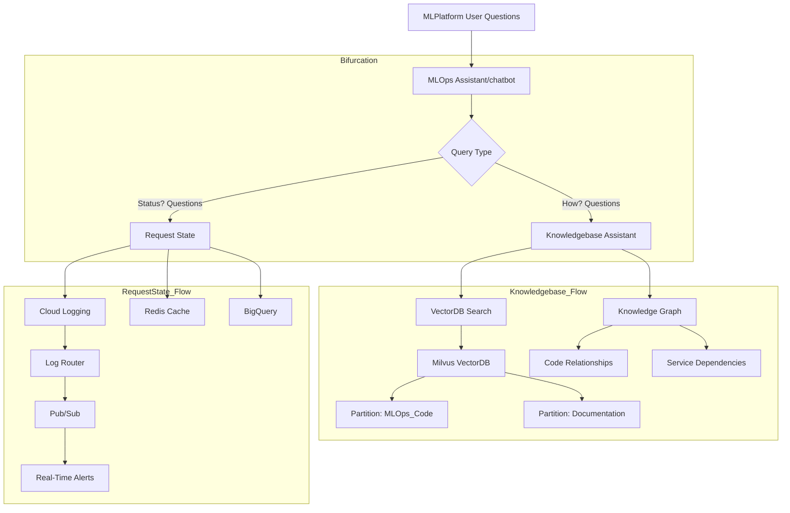
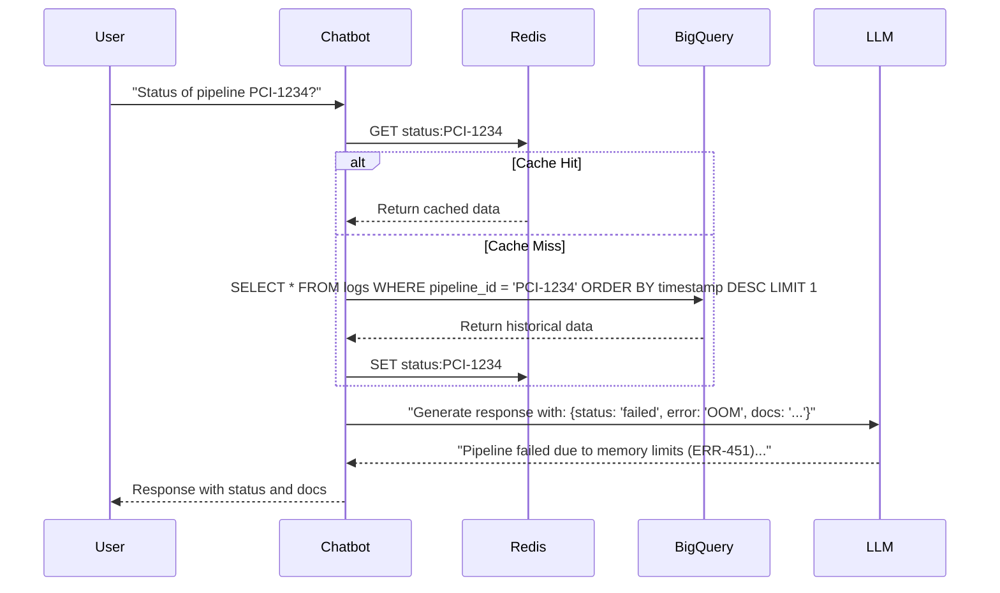

github-chatbot/
├── app/
│   ├── api/                     # FastAPI endpoints
│   │   ├── __init__.py
│   │   ├── endpoints.py         # API routes for querying
│   ├── core/                    # Core logic
│   │   ├── __init__.py
│   │   ├── ingestion.py         # Repo cloning and preprocessing
│   │   ├── vector_db.py         # Vector DB creation and management
│   │   ├── knowledge_graph.py   # Knowledge graph construction
│   │   ├── query_processing.py  # Query handling and LLM integration
│   ├── models/                  # Pydantic models for API
│   │   ├── __init__.py
│   │   ├── schemas.py           # Request/response models
│   ├── utils/                   # Utility functions
│   │   ├── __init__.py
│   │   ├── logger.py            # Logging setup
│   │   ├── config.py            # Configuration loader
│   ├── main.py                  # FastAPI app entrypoint
├── data/                        # Local storage for repos and indexes
│   ├── repos/                   # Cloned GitHub repositories
│   ├── chroma_db/               # Vector DB storage
│   ├── neo4j/                   # Knowledge graph storage
├── tests/                       # Unit and integration tests
│   ├── __init__.py
│   ├── test_ingestion.py
│   ├── test_query_processing.py
├── docker-compose.yml           # Docker setup for all services
├── Dockerfile                   # Dockerfile for FastAPI app
├── requirements.txt             # Python dependencies
├── README.md                    # Project documentation
├── .env                         # Environment variables

**Detailed flow diagrams, system components, and optimizations for multiple repos:**

---

## GitHub Chatbot for MLOps Projects

This document describes the architecture and implementation of a production-oriented chatbot that answers questions by retrieving information from internal GitHub repositories and cloud logging. The system is built to serve MLOps projects, where all knowledge information comes from your repositories (e.g., model registry, data pipelines, SQL conversion tools, document indexing, etc.) and cloud logging for operations assistanance. The solution is designed for developers, architects, and product managers and explains both the high-level design and technical details.

This system combines two critical MLOps functions in one assistant:

1. **Knowledge Assistant**
   Answers technical questions using:
   * Code/documentation from GitHub repositories
   * Architectural knowledge graph
   * Vector similarity search
2. **Operations Assistant**
   Provides real-time insights about:
   * Pipeline execution status
   * SQL generation requests
   * Document processing jobs
   * System health metrics




### **Knowledge Assistant**
Answers technical questions using:* Code/documentation from GitHub repositories

* Architectural knowledge graph
* Vector similarity search

#### **System Architecture (Mermaid Diagram)**

The chatbot ingests multiple GitHub repositories, processes and indexes code and documentation, and uses a hybrid approach of vector search and a knowledge graph to understand and answer queries. The entire system runs within the intranet without relying on external sources.

**System Components**

* **Multi-Repo Ingestion Pipeline:** Clones and preprocesses repositories, performing document chunking with metadata preservation.
* **Hybrid Vector DB Indexing:** Embeds code/document chunks into a vector database for semantic similarity search.
* **Knowledge Graph Integration:** Maps entities (classes, functions, modules) and relationships within and across repos.
* **Query Processing Engine:** Augments user queries, retrieves relevant chunks via vector search and graph lookups, and synthesizes a response with an LLM.
* **UX & Feedback Loop:** Provides a user interface that shows the response along with its source and gathers user feedback.


#### **Detailed Component Breakdown**

##### **1. Multi-Repo Ingestion Pipeline**

This pipeline is responsible for ingesting multiple GitHub repositories related to MLOps projects. The process involves cloning repositories, preprocessing code and documentation, and chunking the content while preserving metadata.

**Key Steps**

* **Repo Cloning:** Clone all whitelisted GitHub repos (e.g., model registry, data pipelines, SQLPlat, document AI pipelines).
* **Preprocessing & Chunking:** Process files with language-specific chunking (e.g., function-level splitting for code, section-based for Markdown).
* **Metadata Enrichment:** Each chunk is tagged with repository name, file type, source path, and other traceability info.

```python
# Enhanced for multiple repos with parallel processing
from concurrent.futures import ThreadPoolExecutor

def process_repo(repo_url):
    repo_name = repo_url.split("/")[-1].replace(".git", "")
    clone_path = f"repos/{repo_name}"
  
    # Clone with error handling
    try:
        clone_repo(repo_url, clone_path)
        docs = load_docs(clone_path)
        return process_docs(docs, repo_name)
    except Exception as e:
        logger.error(f"Failed processing {repo_url}: {e}")
        return []

# Chunking with metadata preservation
def process_docs(docs, repo_name):
    splitter = RecursiveCharacterTextSplitter.from_language(
        language=Language.PYTHON,
        chunk_size=512,
        chunk_overlap=80,
        add_start_index=True
    )
  
    chunks = []
    for doc in docs:
        chunks.extend(splitter.split_documents([doc]))
  
    # Add metadata for traceability
    for chunk in chunks:
        chunk.metadata.update({
            "repo": repo_name,
            "source_hash": hash(chunk.page_content),
            "chunk_type": "code" if "py" in chunk.metadata["source"] else "docs"
        })
  
    return chunks
```

##### **2. Hybrid Vector DB Indexing**

After processing the repositories, the system creates a semantic index of the code and documentation using a vector database. This allows the chatbot to quickly find relevant chunks based on a user query.

**Indexing Process**

* **Embedding Generation:** Convert each chunk to a vector embedding using an embedding model.
* **Vector Storage:** Store the embeddings along with associated metadata.
* **Metadata Indexing:** A separate metadata index enables filtering based on repository, file type, or other custom tags.

```python
# Using metadata-aware indexing
from langchain.vectorstores import Chroma

def create_index(chunks):
    embeddings = OpenAIEmbeddings(model="text-embedding-3-large")
  
    vectorstore = Chroma.from_documents(
        documents=chunks,
        embedding=embeddings,
        collection_metadata={"hnsw:space": "cosine"},
        ids=[f"{chunk.metadata['repo']}_{i}" for i, chunk in enumerate(chunks)],
        collection_name="multi_repo",
        persist_directory="./chroma_db"
    )
  
    # Create separate metadata index
    metadata_index = {
        chunk.metadata["source_hash"]: {
            "repo": chunk.metadata["repo"],
            "file_path": chunk.metadata["source"],
            "line_range": f"{chunk.metadata['start_index']}-{chunk.metadata['end_index']}"
        }
        for chunk in chunks
    }
  
    return vectorstore, metadata_index
```

##### **3. Knowledge Graph Integration**

To complement semantic search, the chatbot builds a knowledge graph that maps code entities (e.g., classes, functions, modules) and their relationships. This enhances query understanding and enables multi-hop reasoning.

**Graph Construction**

* **Entity Extraction:** Parse code using AST or NLP tools (spaCy, PyGithub) to extract entities.
* **Relationship Mapping:** Map relationships such as “calls,” “inherits,” or “modifies” between entities.
* **Graph Storage:** Store the resulting graph in a database (e.g., Neo4j) to support efficient graph queries.


##### **4. Query Processing Flow**

This component handles user queries by combining results from the vector database and the knowledge graph, then synthesizing an answer with an LLM.

**Workflow**

1. **Receive Query:** The user’s question is received via the API.
2. **Query Augmentation:** Parse the query and use the knowledge graph to expand context (e.g., related entities).
3. **Hybrid Search:**
   * **Vector Search:** Retrieve top code and documentation chunks.
   * **Graph Lookup:** Identify related entities and dependencies.
4. **Context Assembly:** Combine the retrieved context.
5. **LLM Synthesis:** Use an LLM (OpenAI/Claude) to generate a response using the assembled context.
6. **Format & Return:** Structure the response along with source citations.

```python
def answer_question(query, vectorstore, kg_connection):
    # Step 1: Query understanding
    parsed_query = parse_query(query)
  
    # Step 2: Knowledge graph expansion
    kg_context = kg_connection.get_related_entities(parsed_query["entities"])
  
    # Step 3: Hybrid search
    results = vectorstore.similarity_search(
        query=query,
        k=5,
        filter={"repo": {"$in": parsed_query["relevant_repos"]}},
        include_metadata=True
    )
  
    # Step 4: Context assembly
    context = assemble_context(
        code_results=results,
        kg_context=kg_context,
        doc_results=full_text_search(query)
    )
  
    # Step 5: LLM response generation
    response = llm.generate(
        system_prompt=create_system_prompt(context),
        user_query=query,
        temperature=0.2
    )
  
    return format_response(response, context.sources)
```

---

##### **5. UX Flow Diagram**

Below is a sequence diagram showing the end-to-end user interaction with the chatbot:

```mermaid
sequenceDiagram
    participant User
    participant UI
    participant Backend
    participant VectorDB
    participant KnowledgeGraph
    participant LLM

    User->>UI: Enters query "How to trigger model training?"
    UI->>Backend: POST /query {text: "trigger model training", repos: ["mlops-tools"]}
  
    Backend->>KnowledgeGraph: Entity recognition and query expansion
    KnowledgeGraph-->>Backend: Related entities and context
  
    Backend->>VectorDB: Find similar chunks (k=5, threshold=0.78)
    VectorDB-->>Backend: Relevant code/docs chunks
  
    Backend->>LLM: Generate response with citations using context from VectorDB and KnowledgeGraph
    LLM-->>Backend: Formatted answer
  
    Backend-->>UI: Streaming response with sources
    UI->>User: Show answer with sources
    User->>UI: 👍/👎 Feedback
    UI->>Backend: Log feedback
```



---


### **Operations Assistant**
Provides real-time insights about:* Pipeline execution status

* SQL generation requests
* Document processing jobs
* System health metrics




#### **6. Production-Grade Optimizations**

**Chunking Strategy**

- **Code Files**: Function-level splitting with AST parsing
- **Markdown Files**: Section-based splitting with header detection
- **Config Files**: Whole-file processing with YAML/JSON validation
- **Overlap**: 15% overlap with sliding window

**Metadata Management**

```python
{
    "repo": "mlops-pipeline",
    "file_type": "python",
    "last_commit": "2024-02-15",
    "authors": ["user@company.com"],
    "imports": ["numpy", "pytorch"],
    "entity_links": ["/graph/DataPreprocessor"]
}
```

**Testing and Validation**

* **Quality Checks:** Ensure each chunk includes valid metadata (e.g., line range, source).
* **Integration Tests:** Verify the correctness of vector search and graph traversal.

**Monitoring**

* **Metrics:** Track query success rate, indexing accuracy, and response time.
* **Logging:** Use Prometheus and Grafana to monitor logs and system health.

#### **7. Deployment Architecture**


---

#### 8. Why knowledge graph

knowledge graph significantly enhances the chatbot’s capabilities by adding  **contextual understanding** ,  **relationship awareness** , and **semantic reasoning** to complement the vector database (which focuses on semantic similarity). Here’s a detailed breakdown of its role:

**1. Solving Complex, Multi-Hop Queries**

 **Problem** : Vector databases alone struggle with queries requiring reasoning across multiple entities or indirect relationships.
 **Solution** : The knowledge graph explicitly maps relationships between code entities, users, and documentation.

 **Example** :

* **User Query** : *"Which contributors modified the `DataValidator` class that interacts with our `model_registry` module?"
* **KG Workflow** :


* **Result** : The graph traverses relationships to identify contributors linked to both `DataValidator` and `model_registry`.

**2. Contextual Disambiguation**

 **Problem** : Terms like "model" or "pipeline" can refer to multiple concepts in codebases.
 **Solution** : The knowledge graph infers meaning from connected entities.

 **Example** :

* **Ambiguous Query** : *"Where is the `pipeline` initialized?"*
* **KG Resolution** :


* **Action** : The chatbot asks follow-up questions based on graph connections:
  *"Do you mean the `DataPipeline` in `data_processing.py` or the `TrainingPipeline` in `configs/training.yaml`?"*

**3. Query Expansion & Improved Retrieval**

 **Problem** : Users often underspecify queries (e.g., missing key terms).
 **Solution** : The graph identifies related entities to expand search context.

 **Example** :

* **Original Query** : *"Why does `load_dataset()` fail?"*
* **KG Expansion** :


* **Enhanced Search** : The vector DB searches for chunks related to `load_dataset`, `DataLoaderConfig`, and `validate_schema`.

**4 Impact Analysis & Dependency Tracking**

 **Problem** : Developers need to assess changes across repos.
 **Solution** : The graph maps code dependencies and data flows.

 **Example** :

* **Query** : *"What will break if I modify `FeatureEngineer` in `repo-A`?"*
* **KG Insight** :


* **Response** :
  *"Modifying `FeatureEngineer` affects `TrainingPipeline` in `repo-B` and `KubernetesService` in `repo-C`. Test these components."*

**5. Proactive Recommendations**

 **Problem** : Users may not know what to ask.
 **Solution** : The graph identifies patterns to suggest relevant queries.

 **Example** :

* **Graph Pattern** : Many teams search for `DataValidator` after modifying `FeatureEngineer`.
* **Chatbot Suggestion** :
  *"Are you looking for `DataValidator` tests? It’s frequently used with `FeatureEngineer`."*

**6. Audit Trails & Compliance**

 **Problem** : Traceability is critical in production systems.
 **Solution** : The graph tracks code-to-user-to-artifact relationships.

 **Example** :

* **Query** : *"Who approved the latest version of `ModelMonitor`?"*
* **KG Response** :


#### **9. Example Workflow Scenarios**

**Scenario 1: Model Registry Query**

* **User Query:** “How can I register a new classical model?”
* **Process:**
  * The ingestion pipeline has already indexed the model registry code.
  * The vector search retrieves code snippets from the FastAPI endpoints.
  * The knowledge graph identifies related entities such as the SDK and Dash UI.
  * The LLM synthesizes an answer explaining that the classical models can be registered via the backend API (invoked by both SDK and Dash UI) and stored in Spanner DB

### Conclusion

This document has provided a comprehensive overview of the internal GitHub chatbot architecture for MLOps projects. By combining a multi-repository ingestion pipeline, hybrid vector database indexing, and a knowledge graph integration, the system is able to dynamically answer technical queries using internal code and documentation. The solution is designed for scalability, maintainability, and accurate, context-rich responses—all within your intranet environment.

Feel free to adjust specific components (e.g., the chunking strategy, embedding model, or LLM service) to best fit the unique requirements of your projects.

### Some useful information

##### **1. How It Helps the Hybrid Search & Knowledge Graph**

* **Hybrid Search:**

  The extracted entities (classes, functions, etc.) are linked to the corresponding code/documentation chunks. When a user asks a question, the system can use both semantic (vector-based) similarity and entity matching (knowledge graph lookups) to retrieve highly relevant information.
* 
* **Knowledge Graph:**

  * **Nodes:** Represent entities (e.g., `DataProcessor`, `process`, `helper_function`).
  * **Edges:** Represent relationships such as “calls,” “inherits from,” or “is defined in.”
  * **Storage:** The graph is stored in a database like Neo4j, where you can run queries such as:

  ```
  MATCH (c:Class {name:"DataProcessor"})-[:CALLS]->(f:Function)
  RETURN f.name

  ```

  **Example in Context:**

  If a query involves “How is data processed?”, the system can traverse the graph to determine that `DataProcessor.process` is involved, and then link back to the vector-indexed code chunk for that method.

  Thus, the combination of AST-based entity extraction and the knowledge graph allows for precise query augmentation and a deeper semantic 		understanding of the codebase.

##### 2. Hybrid Vector Database Indexing

**What It Is:**

Hybrid vector database indexing combines the benefits of vector-based search (using embeddings for semantic similarity) with traditional metadata-based indexing.

**How It Differs from Pure Vector Database Indexing:**

* **Pure Vector Indexing:**
  * Uses embeddings to represent documents in a high-dimensional space.
  * Searches are based solely on cosine similarity (or another similarity metric) of these vectors.
  * It is effective for capturing semantic similarity but may not consider structured metadata like file paths or repository names.
* **Hybrid Approach:**
  * **Combines Vectors with Metadata:** Each document/chunk is stored along with metadata (e.g., repository, file type, commit date).
  * **Filtering:** Searches can be constrained using metadata filters (e.g., only search within a specific repository).
  * **Enhanced Precision:** The hybrid method improves relevance by merging semantic similarity (vector match) with exact filtering (metadata match).

**Example:**

When a user queries about “model training,” the vector search finds all semantically similar chunks. Then, using metadata filtering, the system restricts the results to the repos that are known to handle model training (as determined by the `parsed_query["relevant_repos"]`).
